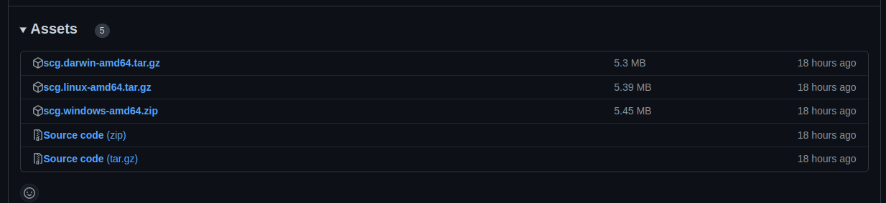

# Мануал по работе с генератором игр для голосового ассистента [**Маруся**](https://marusia.vk.com/)
## Установка 

- Установка библиотеки для работы с игрой
```cmd
go get github.com/ThCompiler/go_game_constractor@latest
```
- Открыть последний [релиз](https://github.com/ThCompiler/go_game_constractor/releases/tag/v0.1.3-alpha) проекта
- Выбрать версию генератора под вашу архитектуру

    * *scg.darwin-amd64.tar.gz* -- генератор для Mac OS на базе amd64 
    * *scg.linux-amd64.tar.gz*  -- генератор для дистрибутивов Линукс на базе amd64
    * *scg.windows-amd64.zip*   -- генератор для Windows на базе amd64

## Создание описания игры
Игра описывается в `yml` файле (поддерживается также `xml` и `json` формат, но они в данном мануале не рассматриваются)

#### Пример
Данный файл описывает игру которая повторяет за пользователем ввод
```yaml
name: 'echo_game'
startScene: "hello"
goodByeCommand: "GoodeBye"
goodByeScene: "goodbye"
script:
  goodbye:
    text:
      string: "GoodyBye"
      tts: "GoodyBye"
    nextScenes:
      - 'goodbye'
  hello:
    text:
      string: "Hello boy. Is number {number}"
      tts: "Hello boy. Is number {number}"
      values:
        number: 'int64'
    nextScene: 'echo'
    isInfoScene: true
    error:
      scene: "goodbye"
  echo:
    text:
      string: "I will Repeat you word"
      tts: "I will Repeat you word"
    nextScenes:
      - 'echoRepeat'
    matchers:
      - 'any'
    error:
      base: "number"
  echoRepeat:
    text:
      string: "You say {userText}"
      tts: "You say {userText}"
      values:
        userText: 'string'
    nextScenes:
      - 'echoRepeat'
    matchers:
      - 'any'
    error:
      base: "number"
```

### Генератор содержит следующие поля описывающие сценарий игры:

- [***name***](#имя-игры)
- [***startScene***](#стартовая-сцена)
- [***goodByeCommand***](#команда-окончания-игры)
- [***goodByeScene***](#сцена-прощания)
- [***matchers***](#описание-правил-проверки-введённых-данных)
- [***script***](#сцены-игры)

#### Имя игры
Указывается название реализуемой игры.
```yaml
name: 'echo_game'
```

#### Стартовая сцена
Указывается название стартовой сцены которая описывается в разделе [***script***](#сцены-игры) с остальными сценами
```yaml
startScene: 'hello'
```

#### Команда окончания игры
Указывается строка которая будет появляться в виде кнопке на каждой проигрываемой сцене. 
При нажатие на данную кнопку будет вызываться сцена прощания.
```yaml
goodByeCommand: "Пока"
```

#### Сцена прощания
Указывается сцена которая будет вызываться при желании игрока выйти из игры на основе реплик содержащих слова *Хватит*, *Закончить*.
Или при нажатии на кнопку окончания игры.
```yaml
goodByeScene: "goodbye"
```

#### Описание правил проверки введённых данных
Описываются пользовательские наборы правил для проверки введённых данных.
Генератор поддерживает два типа таких наборов:
- Сопоставление пользовательского ввода с различными вариантами.
    * `selects` -- список вариантов, с которыми требуется сопоставить ввод пользователя.
  Для более корректной работы лучше указывать без каких-либо знаков препинания, 
  а также избегать присутствия слов *Закончить* или *Хватит*, т.к. данные слова воспринимается Марусей как слова окончания игры
    * `replaceMessage` -- сообщение, которое будет использовано для идентификации набора с выполнившемся правилами. 
  Также этим сообщением будет заменён пользовательский ввод
    * `BuyDrops` -- имя набора
```yaml
  BuyDrops:
    selects:
      - "Хочу купить капельки"
      - "Капельки"
      - "Купить капельки"
      - "Купить капли"
      - "Капли"
      - "Воду"
      - "Хочу купить воду"
      - "Хочу купить капли"
      - "Купить воду"
      - "Вода"
    replaceMessage: "Вода"
```

- Проверка на основе регулярных выражений
  * `regex` -- Правило основанное на регулярном выражении. Пользовательский ввод будет заменён на фразу, удовлетворяющею данному регулярному выражению
  * `nameMatched` -- сообщение, которое будет использовано для идентификации набора с выполнившемся правилами
  * `BuyDrops` -- имя набора
```yaml
  BuyDrops:
    regex: "* капли"
    nameMatched: "Вода"
```

#### Сцены игры
Описывает список сцен из игры.

```yaml
script:
  goodbye:
    text:
      string: "GoodyBye"
      tts: "GoodyBye"
    nextScenes:
      - 'goodbye'
  hello:
    text:
      string: "Hello boy. Is number {number}"
      tts: "Hello boy. Is number {number}"
      values:
        number: 'int64'
    nextScene: 'echo'
    isInfoScene: true
    error:
      scene: "goodbye"
  echo:
    text:
      string: "I will Repeat you word"
      tts: "I will Repeat you word"
    nextScenes:
      - 'echoRepeat'
    matchers:
      - 'any'
    error:
      base: "number"
  echoRepeat:
    text:
      string: "You say {userText}"
      tts: "You say {userText}"
      values:
        userText: 'string'
    nextScenes:
      - 'echoRepeat'
    matchers:
      - 'any'
    error:
      base: "number"
```

Каждая сцена содержит следующие пункты:

* [***text***](#текст-сцены)
* [***isInfoScene***](#является-ли-сцена-информационной)
* [***nextScenes/nextScene***](#следующие-сцены)
* [***buttons***](#кнопки-показываемые-в-сцене)
* [***matchers***](#имена-наборов-правил-проверки-пользовательского-ввода)
* [***error***](#текст-сообщения-на-неверный-ввод-пользователя)


##### Текст сцены
Описание текста который будет выводится пользователю в начале сцене. Поддерживается указание встраиваемых значений внутри строки.
Они записываются как `{nameValue}`. **Очень важно отсутствие пробелом между `{` и `}` и именем значения.**
* `string` -- текст, который будет выведен в сообщение 
* `tts` -- текст, который будет озвучен марусей. Дополнительные правила составления tts можно посмотреть в [документации](https://dev.vk.com/marusia/tts) к Марусе.
* `values` -- значения, которые должны встраиваться в текст. **Эти значения обязательно должны присутствовать в обоих строках** 
    * Представляет собой ключе значение `nameValue`:`type`. Поддерживаются все стандартные типы *Golang*. 
  `nameValue` обязательно должен соответствовать указанному имени внутри строки.
```yaml
    text:
      string: "You say {userText}"
      tts: "You say {userText}"
      values:
        userText: 'string'
```

##### Является ли сцена информационной 
Указывается если данная сцена является информационной, т.е. у данной сцены не вызывается обработка ввода пользователя,
а берётся только текст для пользователя и вызывается следующая сцена. 
Поэтому если сцена информационная, то требуется указывать **только одну следующую сцену с полем `nextScene`**.

Также если сцена информационная, то следующие поля не влияют на результат генерации: `buttons`, `matchers`, `error`. 
```yaml
isInfoScene: true
```

##### Следующие сцены
Имя следующей сцены, либо следующих сцен. Если сцена информационная, то требуется указывать 
только одну сцену в поле `nextScene`, иначе список сцен в поле `nextScenes`.

```yaml
isInfoScene: true
nextScene: 'echo'
```

```yaml
 nextScenes:
   - 'echoRepeat'
```

##### Кнопки показываемые в сцене
Описания кнопок которые будут показаны в текущей сцене
* `agree` -- имя кнопки
* `text` -- текст, который будет показан как текст на кнопке
* `URL` -- ссылка, которую нужно открыть по нажатию на эту кнопку. Если такой функционал не требуется, то следует не **указывать** это поле.
* `Payload` -- некоторая структура, которую нужно передать вместе с кнопкой. 
Когда кнопка будет нажата, вместе с текстом кнопки вернётся payload. *Генератор также генерирует структуры *go*, соответствующие описанным полям.*
```yaml
buttons:
  agree:
    text: "Ага"
    URL: "vk.com"
    Payload:
      ID: 2
```


##### Имена наборов правил проверки пользовательского ввода
Имена наборов правил проверки пользовательского ввода. Есть следующие стандартные наборы:
* `number` -- Набор, выделяющий любое число из ввода пользователя
* `positive_number` -- Набор, выделяющий любое положительное число из ввода пользователя
* `positive_number_in_words` -- Набор, выделяющий любое положительное число слов в ввода пользователя
* `any` -- Набор, принимающий любое сообщение пользователя
* `first_word` -- Набор, выделяющий первое слово из сообщения пользователей
* `agree` -- Набор, определяющий согласие пользователя

```yaml
matchers:
  - "agree"
  - "Back"
```


##### Текст сообщения на неверный ввод пользователя
Вызываемое сообщение или сцена в случае, если ни один из наборов правил не соответствует введённому сообщению пользователя
Есть три вида ошибок:
* Стандартная
  * `base` -- имя стандартной ошибки. Поддерживаются следующие
```yaml
error:
  base: "number"
```
* Сцена ошибки
Будет вызвана названная сцена на неверный ввод пользователя 
```yaml
error:
  scene: "goodbye"
```

* Текстовая ошибка
  * `name` -- имя ошибки. **Должно быть уникальным**. Используется для удобного обращения к тексту ошибки внутри кода.
  * `text` -- текст который выводится при 
```yaml
error:
  name: "NotUnderstandHealSale"
  text: "Я не понимаю о чём вы. Хотите ли вы купить аптечку?"
```


## Генерация кода по описанию

### Пример использования
```(cmd)
scg --output=./scg/ --script=./scg/example/echo_game.yml
```

### Описание

#### Аргументы:
- `-o` `--output=file` - путь к директории куда надо сохранить сгенерированные файлы
- `-s` `--script` - путь к файлу с описанием
- `-v` `--version` - показывает версию исполняемого файла
- `-u` `--update` - выполнить генерацию с сохранением пользовательских файлов

#### Уточнение:
Флаг `--update` сохраняет изменения пользователя
Новые сгенерированные строки, отличные от строк в текущей версии файлов, будут записаны как комментарии. этих строк в  будут вставлены в текущий код
Эти комментарии ограничены строками ```// >>>>>>> Generated```.
Решение о применении изменений остается за вами, так же как и решение об удалении ненужного функциональна.
