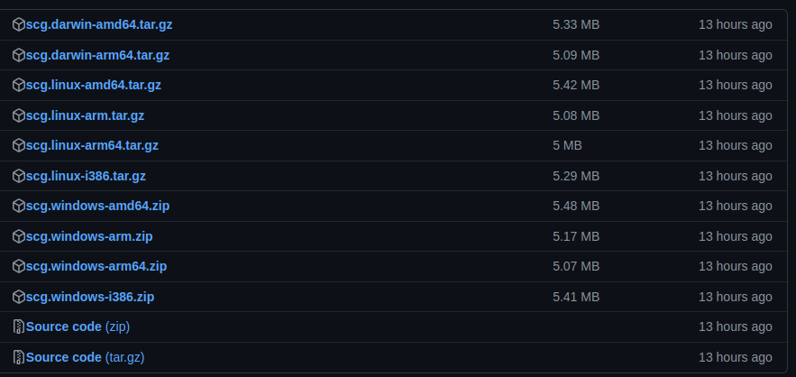

---
title: "Установка генератора и подключения библиотеки"
---

## Установка генератора и подключения библиотеки

### Генератор

#### Установка

Для установки лучше использовать последний [релиз](https://github.com/ThCompiler/go_game_constractor/releases/tag/v0.1.3-alpha) проекта.
В релизе опубликованы генераторы для 3 различных ОС: *Linux*, *MacOS* и *Windows*.



* *scg.darwin-amd64.tar.gz* - генератор для Mac OS на базе amd64
* *scg.darwin-arm64.tar.gz* - генератор для Mac OS на базе arm64
* *scg.linux-amd64.tar.gz*  - генератор для дистрибутивов Линукс на базе amd64
* *scg.linux-arm64.tar.gz*  - генератор для дистрибутивов Линукс на базе arm64
* *scg.linux-rm.tar.gz*     - генератор для дистрибутивов Линукс на базе arm
* *scg.linux-i386.tar.gz*   - генератор для дистрибутивов Линукс на базе i386
* *scg.windows-amd64.zip*   - генератор для Windows на базе amd64
* *scg.windows-arm64.zip*   - генератор для Windows на базе arm64
* *scg.windows-arm.zip*     - генератор для Windows на базе arm
* *scg.windows-i386.zip*    - генератор для Windows на базе i386

##### Пример установки

В примерах используются утилиты для распаковки и скачивания, которые могут быть не установленны
на вашем устройстве. Подразумевается, что вы сами их найдёте и установите. 

> <h5>hint</h5>
> Если вам требуется другая архитектура, то в строке со скачиванием вместо `amd64` укажите вашу архитектуру.

> <h5>hint</h5>
> Если вам требуется другая версия, то в строке со скачиванием вместо `v0.1.4-alpha` укажите нужную версию.

###### Linux

```cmd
  mkdir tmp
  
  # Скачиваем последний релиз
  wget https://github.com/ThCompiler/go_game_constractor/releases/download/v0.1.4-alpha/scg.linux-amd64.tar.gz -P ./tmp
  
  # Распаковываем архив
  tar -xvf ./tmp/scg.linux-amd64.tar.gz -C ./tmp
  
  # Добавляем генератор в утилиты пользователя
  sudo cp ./tmp/scg.linux-amd64/scg /usr/local/bin/
  
  # Очищяем не нужные файлы
  rm -r tmp
```

###### MacOS
```cmd
  mkdir tmp
  
  # Скачиваем последний релиз
  cd tmp && curl -LO ./tmp https://github.com/ThCompiler/go_game_constractor/releases/download/v0.1.4-alpha/scg.darwin-amd64.tar.gz \
  && cd ..

  
  # Распаковываем архив
  tar -xvf ./tmp/scg.darwin-amd64.tar.gz -C ./tmp
  
  # Добавляем генератор в утилиты пользователя
  sudo cp ./tmp/scg.darwin-amd64/scg /usr/local/bin/
  
  # Очищяем не нужные файлы
  rm -r tmp
```

###### Windows
```cmd
  mkdir tmp
  
  # Скачиваем последний релиз
  wget https://github.com/ThCompiler/go_game_constractor/releases/download/v0.1.4-alpha/scg.windows-amd64.zip -P .\tmp
   
  # Скачиваем распаковшик zip-архива
  wget https://www.7-zip.org/a/7z2201-x64.exe -P .\tmp
  
  # Распаковываем архив
  .\tmp\7z2201-x64.exe x scg.windows-amd64.zip -o .\tmp
  
  # Добавляем генератор в утилиты пользователя
  mkdir %USERPROFILE%/scg
  copy .\tmp\scg.windows-amd64\scg %USERPROFILE%\scg
  
  # Очищяем не нужные файлы
  rd -r tmp
```

#### Удаление

###### Linux

```cmd  
  rm -r /usr/local/bin/scg
```

###### MacOS
```cmd
  rm -r /usr/local/bin/scg
```

###### Windows
```cmd
  rd -r %USERPROFILE%\scg
```

> <h3>Важно</h3>
> Перед началом использования генератора обязательно инициализируйте go приложение в директории, где вы хотите сгенерировать проект.
> `go init pkg_name`

------------------------------------------------------------

### Библиотека

#### Установка
```cmd
  go get github.com/ThCompiler/go_game_constractor@latest
```
